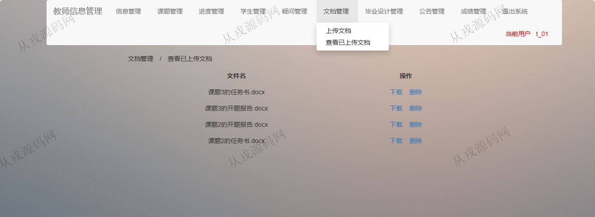

<h1 align="center">91.毕业设计（论文）管理系统2</h1>

 获取sql文件 QQ: 386869957 QQ群: 377586148 

 [推荐站点: 从戎源码网](https://armycodes.com/) 

## 简介

> 本代码来源于网络,仅供学习参考使用!
>
> 提供1.远程部署/2.修改代码/3.设计文档指导/4.框架代码讲解等服务
> 
> 访问地址：http://localhost:8080/BSManager/index.jsp
> 
> 管理员登录地址：http://localhost:8080/BSManager/admin/index.jsp
> 
> 管理员用户名密码：admin 123456
> 
> 教师登录地址：http://localhost:8080/BSManager/teacher/teacherLogin.jsp
> 
> 教师用户名密码：t_01 123456
> 
> 学生登录地址：http://localhost:8080/BSManager/student/studentLogin.jsp
> 
> 学生用户密码：142002 123456
>

## 项目介绍
基于ssm的毕业设计（论文）管理系统：前端 jsp、jquery，后端 maven、springmvc、spring、mybatis，角色分为管理员、老师、学生；集成课题管理、文档管理、成绩管理等功能于一体的系统。

## 功能介绍

### 管理员

- 信息管理：查看自己的个人信息，密码修改
- 导师管理：添加导师，导师列表查询，信息修改和删除
- 学生管理：学生信息的增删改查
- 选题管理：课题列表查询，通过和未通过操作
- 公告管理：发布公告，公告列表查询，公告删除
- 查看已上传论文：论文列表查询

### 教师

- 信息管理：查看自己的个人信息，密码修改
- 课题管理：课题信息的增删改查
- 进度管理：发布任务书，发布开题报告，审核开题报告，发布阶段任务，审核阶段任务
- 学生管理：学生列表查询
- 疑问管理：提出的疑问，解决的方案
- 文档管理：上传文档，查看已上传的文档，文档下载和删除
- 毕业设计管理：审核论文，答辩资格名单，通过和未通过操作
- 公告管理：发布公告，公告列表查询
- 成绩管理：添加成绩，成绩列表查询，成绩修改

### 学生

- 信息管理：查看自己的个人信息，密码修改
- 课题管理：选择课题，查看结果
- 进度管理：开题报告完成情况，查看任务书及开题报告，查看阶段任务
- 文档管理：上传文档，查看已上传的文档
- 疑问管理：提出的疑问，查看解答
- 公告管理：查看公告
- 查看答辩资格：查询自己是否有答辩的资格
- 成绩管理：学生成绩查询，仅能查询自己的

## 环境

- <b>IntelliJ IDEA 2021.3</b>

- <b>Mysql 5.7.26</b>

- <b>Maven</b>

- <b>Tomcat 7.0.73</b>

- <b>JDK 1.8</b>

## 运行截图

